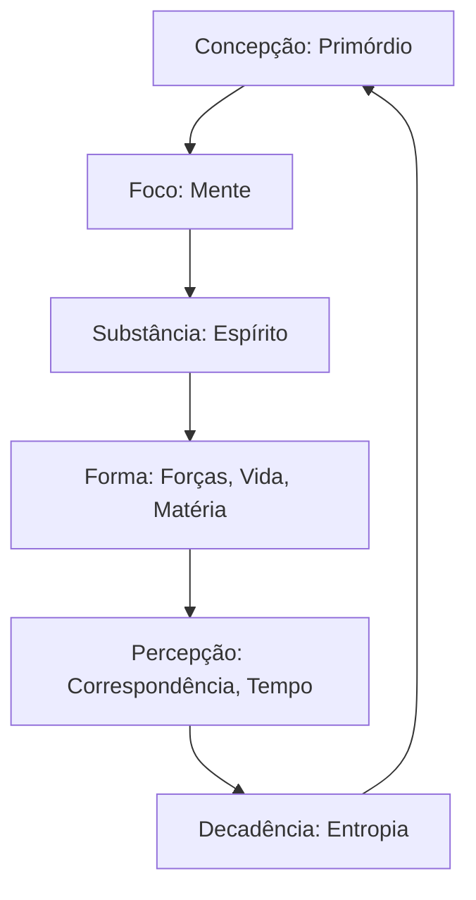

# Capítulo 2: Mágika - A Arte da Realidade

Este documento consolida as regras sobre a natureza da Mágika Dinâmica, o Consenso, o Efeito Paradoxo e os princípios fundamentais das Nove Esferas.

---

## 1. Mágika Estática vs. Mágika Dinâmica

O SRD estabelece uma distinção mecânica fundamental entre a magia praticada por diferentes seres do Mundo das Trevas:
* **Mágica Estática:** Poderes sobrenaturais rígidos, lineares e padronizados que operam sem o risco de Paradoxo. É a magia de vampiros (Disciplinas), lobisomens (Dons), fadas (Contratos) ou magos estáticos (feiticeiros adormecidos).
* **Mágika Dinâmica:** A mágika verdadeira, praticada por [Despertos](file:///d:/OneDrive/Documentos/RPG%20a%20la%20Carte/Mago,%20presencial/07_PJs/Niki.md). É extremamente flexível e aberta, definida pela Areté e pelo Foco do mago. O preço dessa flexibilidade ilimitada é o risco contínuo do Paradoxo ao confrontar o Consenso.
* **Tecnomágika:** A mágika dinâmica operada através de instrumentos científicos ou pseudocientíficos. Embora o tecnomante dependa de aparatos/gadgets para focar sua crença, o efeito permanece dinâmico.

---

## 2. A Realidade Consensual e as Consequências

* **O Consenso:** A realidade estruturada e mantida pela crença coletiva das Massas de [Adormecidos](file:///d:/OneDrive/Documentos/RPG%20a%20la%20Carte/Mago,%20presencial/05_Faccoes/Adormecidos.md).
* **Mágika Coincidente:** Efeitos mágicos que se disfarçam sob coincidências aceitáveis pelo Consenso. Minimizam o Efeito Paradoxo.
* **Mágika Vulgar:** Feitos espalhafatosos que violam flagrantemente as leis do Consenso (ex: lançar fogo pelas mãos sem instrumentos). Atraem imediatamente o Paradoxo.
* **O Efeito Paradoxo:** Reação da realidade contra a alteração indevida de seus padrões. Manifesta-se como:
  * **Choques de Paradoxo (Queima):** Danos diretos na integridade física/energética do mago.
  * **Espíritos do Paradoxo:** Entidades que surgem para aprisionar ou punir o conjurador.
  * **Silêncio:** Estados de insanidade recursiva e desconexão da realidade.
* **Ressonância e Sinergia:**
  * **Ressonância:** O eco vibracional residual que as emoções e a mágika do Desperto deixam em seu padrão físico e no ambiente.
  * **Sinergia:** O eco vibracional externo (de locais ou objetos carregados) que se anexa ao padrão do mago.

---

## 3. O Ciclo de Efeito e as Nove Esferas

Toda a realidade é manipulável através de nove princípios universais, divididos no **Ciclo do Efeito**:

### As Nove Esferas da Mágika

1. **Correspondência:** O princípio da conexão espacial. (Nomes Tecnocratas: *Princípios de Correspondência* ou *Dados*).
2. **[Entropia](file:///d:/OneDrive/Documentos/RPG%20a%20la%20Carte/Mago,%20presencial/07_PJs/Niki.md):** O controle do acaso, destino, probabilidade e decadência. (Nome Tecnocrata: *Controle de Estado Entrópico*).
3. **Espírito:** Manipulação da Película e viagem umbral. (Nome Tecnocrata: *Parafísica da Ciência Dimensional*).
4. **Forças:** Domínio das energias elementares físicas (eletricidade, fogo, gravidade). (Nome Tecnocrata: *Parafísica Baseada em Força*).
5. **[Materia](file:///d:/OneDrive/Documentos/RPG%20a%20la%20Carte/Mago,%20presencial/07_PJs/Niki.md):** Controle de estados inertes inanimados e alquimia física. (Nome Tecnocrata: *Ciências dos Materiais*).
6. **[Mente](file:///d:/OneDrive/Documentos/RPG%20a%20la%20Carte/Mago,%20presencial/07_PJs/Niki.md):** Exploração e controle da consciência e psiquismo. (Nome Tecnocrata: *Psicodinâmica*).
7. **[Primordio](file:///d:/OneDrive/Documentos/RPG%20a%20la%20Carte/Mago,%20presencial/07_PJs/Niki.md):** Manipulação da energia mística bruta (Quintessência) e do [Sorvo](file:///d:/OneDrive/Documentos/RPG%20a%20la%20Carte/Mago,%20presencial/07_PJs/Niki.md) (muito presente no [Sangue](file:///d:/OneDrive/Documentos/RPG%20a%20la%20Carte/Mago,%20presencial/06_Itens/Sangue.md)). (Nome Tecnocrata: *Teoria da Utilidade Primária*).
8. **Tempo:** Controle da cronologia, dilatação e percepção do tempo. (Nome Tecnocrata: *Ciência Temporal*).
9. **[Vida](file:///d:/OneDrive/Documentos/RPG%20a%20la%20Carte/Mago,%20presencial/07_PJs/Niki.md):** Domínio da biologia, tecidos celulares, cura e alteração orgânica. (Nome Tecnocrata: *Ciências da Vida*).

* **Esfera de Afinidade:** A primeira esfera com a qual o Desperto estabelece conexão durante o Despertar. Define sua especialidade mística primordial.
