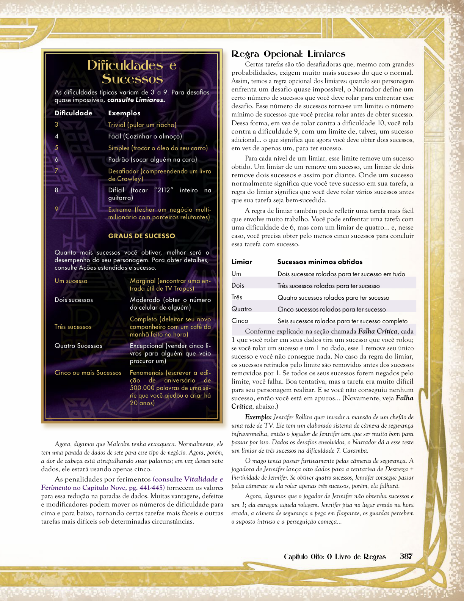

# Capítulo 8: O Livro das Regras

Este documento consolida as regras fundamentais do Sistema Storyteller para Mago 20 Anos, incluindo rolagens de dados, dificuldades, sucessos, falhas críticas e os tipos de ações.

---

## 1. O Núcleo do Sistema (Rolar d10)

Todas as resoluções de conflitos dramáticos no jogo utilizam dados de 10 faces (d10).
* **Parada de Dados (Dice Pool):** A soma dos pontos de um Atributo + uma Habilidade apropriados para a tarefa. Cada ponto equivale a um dado jogado.
* **Dificuldade:** O número alvo (de 3 a 9) que cada dado individual deve igualar ou superar para ser considerado válido. A dificuldade padrão é **6**.
* **Sucesso:** Cada dado que iguala ou supera a dificuldade. A quantidade de sucessos determina a qualidade da ação:
  * *1 sucesso:* Marginal.
  * *2 sucessos:* Moderado.
  * *3 sucessos:* Completo.
  * *4 sucessos:* Excepcional.
  * *5 ou mais sucessos:* Lendário (fenomenal).
* **Regra de Ouro:** As regras servem à narrativa. Se rolar dados retardar o fluxo dramático de uma cena simples ou se o fracasso não gerar consequências dramáticas interessantes, ignore a jogada e conceda sucesso automático.

---

## 2. Falhas, Falhas Críticas e a Regra do 1

* **A Regra do 1:** Cada resultado de face **1** obtido em qualquer dado da rolagem anula 1 sucesso obtido.
* **Falha Simples:** Ocorre quando nenhum dado iguala ou supera a dificuldade, mas também não há resultados "1" sobressalentes na rolagem. A ação não é realizada, mas nenhum desastre acontece.
* **Falha Crítica (Botch):** Ocorre se o jogador **não obtiver nenhum sucesso** na rolagem e obtiver **um ou mais resultados "1"**. Isso indica um fracasso desastroso (ex: travar permanentemente um computador ao tentar hackeá-lo ou disparar o próprio alarme na invasão).

* **Regra Opcional - Limiares (Thresholds):** Para tarefas altamente exigentes ou desafiadoras, o Narrador pode aplicar um Limiar (um número fixo de sucessos que são subtraídos dos sucessos líquidos antes de determinar a vitória).

---

## 3. Tipos de Ações

As ações dos personagens dividem-se em categorias de resolução mecânica:

| Tipo de Ação | Resolução Mecânica | Exemplos |
| :--- | :--- | :--- |
| **Reflexiva** | Não consome tempo e não exige rolagens (a menos que seja absorção de dano). | Gastar Força de Vontade, absorver dano com Vigor, falar uma frase curta. |
| **Simples** | Exige um único teste e um único sucesso líquido para concluir a tarefa. | Socar um oponente, disparar uma arma, saltar uma vala. |
| **Múltiplas** | Dividir a concentração em várias ações no mesmo turno. Usa-se a **menor parada de dados** entre as tarefas e divide-se essa quantidade entre elas. | Correr por um corredor e simultaneamente disparar contra um inimigo. |
| **Estendida** | Tarefas complexas que exigem acumular um número alvo de sucessos ao longo de várias jogadas (cada jogada representa um intervalo de tempo). | Hackear um servidor corporativo (ex: 15 sucessos), realizar um ritual místico. |
| **Resistida** | Disputa direta entre dois personagens. Ambos rolam e os sucessos do oponente anulam um a um os sucessos do conjurador. | Furtividade de um mago vs. Percepção + Prontidão de um guarda. |
| **Estendida e Resistida** | Competição prolongada e direta em turnos limitados. Vence quem acumular mais sucessos ao final. | Perseguições de veículos, debates virtuais complexos. |

---

## 4. Cooperação e Sinergia (Regras Opcionais)

* **Trabalho em Equipe (Teamwork):** Vários personagens somam seus sucessos em uma ação estendida. Uma falha crítica de um dos membros arruína o esforço coletivo, a menos que o membro decida "assumir a falha crítica", isolando o desastre em si mesmo e permitindo que os outros continuem.
* **Testes Complementares (Synergistic Rolls):** Rolar uma habilidade secundária ou de suporte para facilitar o teste principal (ex: rolar Percepção + Prontidão para estudar as reações sociais de um salão antes de rolar Etiqueta). Cada sucesso obtido além do primeiro no teste de suporte reduz a dificuldade do teste principal em -1 (até um limite máximo de -3 na dificuldade).

---

## 5. Cópias Literais do Livro Oficial

### Tabela de Dificuldades e Sucessos

