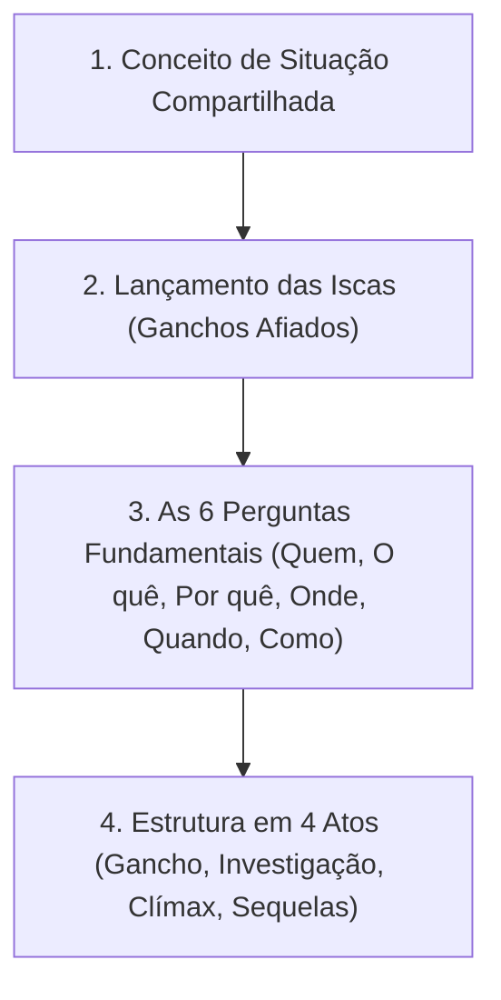
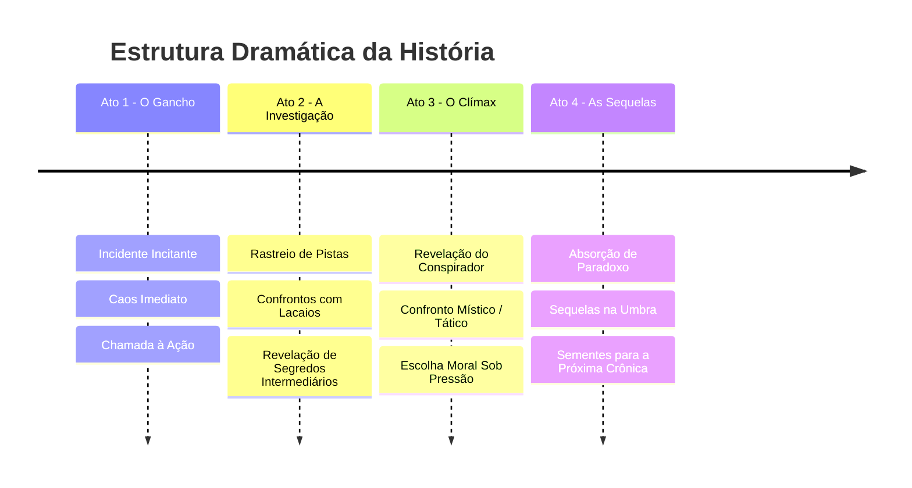

# Framework de Construção de Histórias para Mago: A Ascensão (M20)

Este compêndio é a digestão completa do framework narrativo do livro básico de *Mago 20 Anos* (extraído da seção *Construindo Um Mistério* até *Estrutura e Elementos da História*), projetado para ajudar o Narrador (Storyteller) a estruturar aventuras investigativas, enredos místicos e crises de realidade.

---

## 🧭 Pilares do Framework Narrativo

---

## 1. O Conceito da Situação Compartilhada

Antes de iniciar a aventura, o Narrador estabelece a **situação compartilhada** que unifica o grupo de personagens (mesmo quando composto por facções e paradigmas antagônicos):

* **Associação Compartilhada:** Os personagens pertencem a uma mesma estrutura formal (uma cabala da Tradição, uma Capela regional, um Amálgama Tecnocrata). A hierarquia institucional e os deveres formais superam rivalidades pessoais.
* **Território Compartilhado:** Os heróis compartilham a defesa de um local de alto valor emocional ou místico (um Nodo neutro na metrópole, um bairro sitiado, um laboratório de pesquisa ou um refúgio de adormecidos).
* **Colaboração por Projeto Mútuo:** Um objetivo prático comum une os magos (uma expedição umbral, o desenvolvimento de um reagente místico ou a investigação de surtos de Paradoxo).
* **Aliança Improvável por Ameaça Maior:** Diante de uma ameaça existencial (corrupção Nefândica, incursões de Marauders ou desastres metafísicos), inimigos implacáveis (como um Terno Preto renegado e um vidente em Êxtase) pactuam uma aliança temporária.

---

## 2. Jogando as Iscas: Os Ganchos Afiados (Hooks)

Um gancho narrativo **não é uma sugestão educada, mas uma chamada irresistível à ação**. O anzol agarra a rotina dos personagens e os arrasta para o epicentro da crise:

* **Características do Gancho Afiado:**
  * **Força Irresistível:** Um telefone que toca às 3h da manhã, uma bomba de Quintessência que explode no set de filmagem, um corpo que colapsa com sangue brilhante ou um mensageiro espiritual que morre entregando um aviso.
  * **Múltiplos Anzóis por História:** O Narrador insere um gancho inicial para colocar a história em movimento e ganchos intermediários a cada sessão para manter os PJs engajados.
  * **Variedade de Iscas:** Alterna-se entre ameaças a antecedentes (aliados sequestrados, Nodos sob ataque), anomalias de Paradoxo no bairro e ofertas de segredos arcanos raros.

---

## 3. As 6 Perguntas Fundamentais de Construção do Enredo

Para que o mistério seja sólido e investigativo, o Narrador deve responder a seis perguntas antes de apresentar o caso aos jogadores:

### 1. QUEM? (As Entidades e o Conflito)
* **Quem está fazendo o quê a quem?**
* Identifique a força antagônica (um barão de droga sintética de sangue, um esquadrão da ABIN, um Mestre de Forças fanático ou corruptores Nefândicos) e determine as vítimas (adormecidos, viciados, espíritos locais ou cabalas rivais).

### 2. O QUE? (O Objeto de Disputa)
* **O que exatamente está em jogo?**
* A disputa deve envolver elementos com peso místico ou humano real: o controle de um Nodo de alta ressonância, a posse de uma Maravilha ancestral, o silenciamento de um infectologista adormecido ou a preservação da Película local.

### 3. POR QUE? (As Motivações Profundas)
* **Por que os antagonistas estão agindo e o que esperam ganhar?**
* Evite vilões carnavalescos sem causa. As motivações devem derivar de ganância corporativa, pavor do Paradoxo, vingança por traumas passados (ex: perda de entes queridos na pandemia) ou convicção ideológica de Ascensão.

### 4. ONDE? (O Palco da Crise)
* **Onde estas coisas estão acontecendo e por que lá?**
* O local possui significado místico ou geográfico: uma fábrica abandonada que oculta um nó de entregas, um set de filmagem saturado de energia emocional, um laboratório de virologia ou a Penumbra Média de um parque urbano.

### 5. QUANDO? (O Fator Tempo)
* **Quando está acontecendo e por que NÃO em outro momento?**
* Defina a janela de oportunidade que força a urgência: a aproximação de um alinhamento planetário, o prazo de um mandado de segurança nacional da ABIN, a maturação de uma remessa de droga mística ou a iminência de um despejo corporativo.

### 6. COMO? (A Trilha de Pistas)
* **Como o crime/anomalia foi executado e como os PJs podem descobrir?**
* Espalhe pistas redundantes em múltiplos domínios (amostras biológicas para Medicina/Vida, logs de servidores para Computação/Correspondência, rastros de névoa para Visão Espiritual e depoimentos de testemunhas civis para Investigação/Manha).

---

## 4. A Estrutura em 4 Atos da História

### ATO I: O Gancho (Abertura Disruptiva)
* O cotidiano dos magos é interrompido por um evento dramático inevitável.
* Apresentação da cena da crise inicial e lançamento do primeiro gancho.
* Os PJs são forçados a colaborar imediata e taticamente.

### ATO II: A Investigação (Desenvolvimento e Escalada)
* Coleta de pistas, interrogatórios de informantes e exploração de locais arcanos.
* Incursões na Penumbra ou na Teia Digital para rastrear ressonâncias ocultas.
* Escaramuças contra lacaios secundários e primeiros avisos de agentes da Tecnocracia ou da ABIN.

### ATO III: O Clímax (A Virada e o Confronto)
* A revelação do verdadeiro mandante por trás do mistério e o choque de intenções.
* Confronto decisivo em um local saturado de energia mística ou risco de Paradoxo.
* Escolha moral sob extrema pressão: salvar adormecidos versus capturar o antagonista, ou invocar feitiçaria vulgar arriscando o acúmulo de Paradoxo.

### ATO IV: As Sequelas (Resolução e Consequências)
* Tratamento dos feridos e contabilização das perdas.
* Análise da reação do Consenso local (abafamento por notícias falsas ou investigação policial).
* Absorção do Paradoxo acumulado, purificação da ressonância do Nodo e distribuição de XP.
* Registro das sementes de conspiração que se desdobrarão no próximo arco de crônica.
