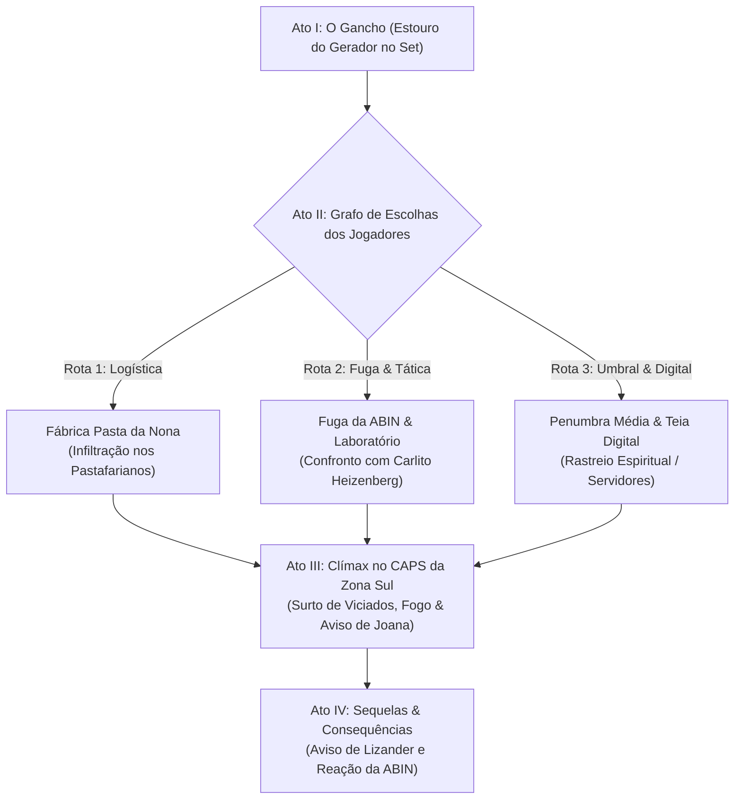

# Roteiro de Framework Narrativo Interativo: Sessão 01 — O Sangue da Metrópole

Este documento apresenta a estrutura da **Sessão 01**, totalmente customizada com as escolhas efetuadas para a crônica: a Situação Compartilhada no Set, o Gancho do Gerador, o foco no Tráfico de Sangue e um **Grafo de Escolhas Não-Linear no Ato II**.

---

## 🧭 Visão Geral e Grafo de Desdobramentos da Sessão 01

---

## 1. O Conceito da Situação Compartilhada (Jogada na Sessão 01)

* **Local do Incidente:** **Casa / Clínica do Dr. Hughie**.
* **O Ocorrido em Jogo:**
  * Os personagens estavam reunidos ou próximos à residência/consultório do médico Hughie.
  * Um motoboy do **Appetito Delivery** colidiu violentamente contra o **portão da casa de Hughie**.
  * Os personagens socorreram/abordaram a cena e abriram o baú de entregas da moto.
* **Situação Atual do Grupo (Gancho Ativo / Ponto de Partida):** Após recolherem a carga do baú da moto acidentada no portão de Hughie, os personagens se deslocaram e **estão reunidos no Centro de Treinamento Akashayano do Sr. Hu** ([centro_de_treinamento_sr_hu.md](../03_lugares/centro_de_treinamento_sr_hu.md)), com a droga em mãos, sem saber exatamente o que fazer com ela e decidindo o próximo passo.
  * **Revelação Mística de Jhonny D. Lee:** No dojô, Lee realizou uma rolagem bem-sucedida de **Vidas Passadas**. Ele descobriu que é a **reencarnação de um lendário Defensor** que surge ciclicamente na Terra quando grandes ameaças se erguem. Através desse contato com a memória ancestral, Lee recuperou a habilidade e fluência no **idioma Chinês** pertencente àquela vida pregressa.

---

## 2. O Gancho do Portão e o Baú da Moto

### O Conteúdo do Baú:
* Frascos contendo o líquido carmesim espesso (**droga sintética de Quintessência residual**).
* Smartphone trincado do entregador com rotas e mensagens criptografadas de entrega.
* Notas e códigos de rastreio vinculados a entregas suspeitas.

### Ganchos Intermediários Imediatos:
* **Chegada da ABIN:** Um veículo sem placas da [ABIN.md](../05_faccoes/abin.md) encosta para apreender a mochila de entregas antes da chegada da polícia civil.
* **A Live de Bernardino:** [Bernardino.md](../02_npcs/bernardino.md) abre uma transmissão alegando que a explosão é "sabotagem de seitas contra vacinas investigadas por [Elizabeth_Barcelos.md](../02_npcs/elizabeth_barcelos.md)".

---

## 3. As 6 Perguntas Investigativas

1. **QUEM?** [Carlito_Heizenberg.md](../02_npcs/carlito_heizenberg.md) (alquimista) e os [Pastafarianos.md](../05_faccoes/pastafarianos.md) (logística do Appetito Delivery). Vítima em risco: a enfermeira [Angela.md](../02_npcs/angela.md) no CAPS.
2. **O QUE?** O controle da droga de Quintessência refinada de sangue de mortos da pandemia e a descriptografia do smartphone do motoboy.
3. **POR QUE?** Carlito busca lucro e controle do submundo; a ABIN quer ocultar feitiçaria no Brasil; Ângela quer salvar viciados em colapso.
4. **ONDE?** Do set de filmagem para a [Fabrica_Pasta_da_Nona.md](../03_lugares/fabrica_pasta_da_nona.md), culminando no CAPS da Zona Sul.
5. **QUANDO?** Noite de chuva forte. A amostra da droga deteriora-se em 12 horas.
6. **COMO? (Pistas Redundantes):**
   * *Vida/Medicina:* Revela alteração celular mística no sangue do entregador.
   * *Computação/Correspondência:* Descriptografa o GPS do smartphone mostrando rotas da fábrica.
   * *Espírito:* Diálogo com gafflings da Penumbra mostrando que espíritos foram subornados com Tass.

---

## 4. Estrutura dos 4 Atos com Grafo de Opções no Ato II

### ATO I: O Gancho no Set (Caos do Gerador)
* **Cena 1:** A explosão do gerador interrompe a tomada de Jhonny.
* **Conflito:** Despistar Adormecidos em pânico, anular a névoa de Paradoxo e impedir que os agentes da ABIN tomem a mochila com os frascos da droga.

---

### ATO II: Grafo de Escolhas dos Jogadores (3 Rotas Possíveis)

O grupo pode decidir qual caminho seguir para desvendar a origem da droga:

#### 🟢 ROTA 1: Investigação Logística (A Fábrica Pasta da Nona)
* **Ação:** O grupo usa os dados do GPS do smartphone para ir à [Fabrica_Pasta_da_Nona.md](../03_lugares/fabrica_pasta_da_nona.md).
* **Desdobramento:** Infiltração entre o maquinário de trigo onde os [Pastafarianos.md](../05_faccoes/pastafarianos.md) empacotam sangue refinado dentro de caixas de alimentos.
* **Confronto:** Luta ou negociação contra o *Chef Alquimista* e entregadores armados.
* **Recompensa da Rota:** Descobrem que o lote principal foi enviado para o CAPS da Zona Sul.

#### 🔵 ROTA 2: Fuga & Interrogatório Tático (Laboratório de Carlito)
* **Ação:** Os PJs capturam um agente da ABIN ou rastreiam o fornecedor de peças da moto.
* **Desdobramento:** Perseguição veicular pelas ruas chuvosas e invasão ao laboratório clandestino de [Carlito_Heizenberg.md](../02_npcs/carlito_heizenberg.md).
* **Confronto:** Armadilhas alquímicas e confronto com capangas de Carlito.
* **Recompensa da Rota:** Descobrem o antídoto e que Carlito mandou incendiar o CAPS para queimar arquivos.

#### 🟣 ROTA 3: Incursão Umbral & Teia Digital (Penumbra e Data Center)
* **Ação:** Os PJs atravessam a Película (*Espírito 3*) ou enviam projeções digitais (*Computação/Correspondência*) na [Sede_Data_Center.md](../03_lugares/sede_data_center.md).
* **Desdobramento:** Navegação pela Penumbra Média seguindo o rastro de espíritos de fuligem subornados.
* **Confronto:** Combate efêmero contra Gafflings corrompidos que tentam apagar as evidências.
* **Recompensa da Rota:** Interceptam o canal espiritual de [Joana_Pipoquinha.md](../02_npcs/joana_pipoquinha.md) avisando sobre o ataque iminente de [Lizander_Filho_do_Raio.md](../02_npcs/lizander_filho_do_raio.md) no CAPS.

---

### ATO III: O Clímax no CAPS da Zona Sul
* **Convergência:** Independentemente da Rota escolhida no Ato II, todas as pistas convergem para o CAPS da Zona Sul.
* **Cena de Ápice:** A enfermeira [Angela.md](../02_npcs/angela.md) está cercada por pacientes em overdose violenta enquanto capangas de Carlito ateiam fogo no prédio.
* **A Virada:** O rádio do local começa a estalar com a voz de [Joana_Pipoquinha.md](../02_npcs/joana_pipoquinha.md): *"Fujam! Meu pai enviou o raio!"*
* **Decisão Moral Sob Pressão:** Salvar os Adormecidos do incêndio usando mágica vulgar ou perseguir o químico de Carlito antes da chegada da tempestade de relâmpagos de Lizander.

---

### ATO IV: Sequelas e Consequências
* **Resolução:** Resgate das vítimas e contenção das chamas.
* **Recompensas:** Obtenção de 1 frasco de **Quintessência Sintética Purificada** (3 pontos).
* **Ganchos Futuros:** A ABIN coloca a cabala em lista de vigilância e a tempestade de [Lizander_Filho_do_Raio.md](../02_npcs/lizander_filho_do_raio.md) atinge o horizonte de São Paulo, iniciando o prenúncio da Sessão 02.
