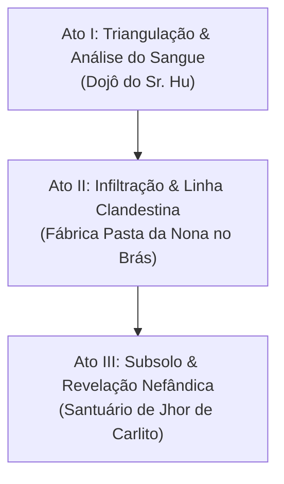

# Roteiro da Sessão 02 — O Segredo da Pasta da Nona

Este documento organiza a **Sessão 02** de forma modular, categorizada em **Locais**, **Personagens**, **Itens/Evidências** e **Eventos**, totalmente interligados por referências diretas no workspace.

---

## 📍 1. Locais Envolvidos

* [**Centro de Treinamento do Sr. Hu**](file:///home/pedrogsribeiro/Documentos/Mago%20Presencial%20Ralc/03_lugares/centro_de_treinamento_sr_hu.md): Dojô akashayano onde o grupo está reunido analisando as amostras e onde Jhonny D. Lee ativou a memória de sua vida pregressa.
* [**Fábrica Pasta da Nona (Nó B - Brás)**](file:///home/pedrogsribeiro/Documentos/Mago%20Presencial%20Ralc/03_lugares/fabrica_pasta_da_nona.md): Instalação industrial de massas no Brás usada como fachada de distribuição e refinaria clandestina.
* **Galpão das Centrifugadoras (Térreo da Fábrica)**: Área industrial com misturadores de molho adaptados para purificação de sangue e sêmola.
* **Subsolo & Santuário de Jhor**: Câmara fria desativada no subsolo que oculta a refinaria mística e o altar profano de Entropia de Carlito Heizenberg.
* [**Circo Itinerante & Tenda de Madame Clotilde**](file:///home/pedrogsribeiro/Documentos/Mago%20Presencial%20Ralc/03_lugares/circo_itinerante.md): Circo itinerante onde atende a cartomante Verbena Madame Clotilde, mentora de Lily e Nina.
* [**Hospital CAPS Zona Sul (Nó C)**](file:///home/pedrogsribeiro/Documentos/Mago%20Presencial%20Ralc/09_arco_01_o_sangue_da_metropole/03_no_c_caps_zona_sul.md): Ponto de origem do sangue desviado de pacientes (Nó futuro).
* [**Sede Data Center & ABIN (Nó D)**](file:///home/pedrogsribeiro/Documentos/Mago%20Presencial%20Ralc/09_arco_01_o_sangue_da_metropole/04_no_d_data_center_e_abin.md): Servidores centrais e monitoramento estatal de transações em cripto (Nó futuro).
* [**Santuário de Lizander (Nó E)**](file:///home/pedrogsribeiro/Documentos/Mago%20Presencial%20Ralc/09_arco_01_o_sangue_da_metropole/05_no_e_santuario_de_lizander.md): Nódulo elétrico de Forças que recebe dízimo de Quintessência (Nó futuro).

---

## 👥 2. Personagens & Ameaças Presentes

### NPCs Principais
* [**Madame Clotilde**](file:///home/pedrogsribeiro/Documentos/Mago%20Presencial%20Ralc/02_npcs/madame_clotilde.md): Cartomante Verbena (Arete 4) itinerante com o circo, mentora de Lily e Nina.
* [**Carlito Heizenberg (Nefandus Barabbi)**](file:///home/pedrogsribeiro/Documentos/Mago%20Presencial%20Ralc/02_npcs/carlito_heizenberg.md): Alquimista que finge ser mercenário, mas atua como Barabbi disseminando Jhor através da droga sintética.
* [**Angela**](file:///home/pedrogsribeiro/Documentos/Mago%20Presencial%20Ralc/02_npcs/angela.md): Enfermeira Desperta do CAPS Zona Sul cujos prontuários de pacientes aparecem nos arquivos de sangria.
* [**Bernardino**](file:///home/pedrogsribeiro/Documentos/Mago%20Presencial%20Ralc/02_npcs/bernardino.md): Influenciador digital cujas carteiras de criptomoedas financiam a frota de entregas.
* [**Lizander (Filho do Raio)**](file:///home/pedrogsribeiro/Documentos/Mago%20Presencial%20Ralc/02_npcs/lizander_filho_do_raio.md): Mestre de Forças fanático alimentado remotamente pela Quintessência refinada.
* [**Elizabeth Barcelos**](file:///home/pedrogsribeiro/Documentos/Mago%20Presencial%20Ralc/02_npcs/elizabeth_barcelos.md): Infectologista cujas vacinas deixaram marcadores imunológicos detectados no sangue.
* [**Joana Pipoquinha**](file:///home/pedrogsribeiro/Documentos/Mago%20Presencial%20Ralc/02_npcs/joana_pipoquinha.md): Espírito da filha de Lizander com conexões no plano efêmero.

### Fichas das Ameaças em Cena

```yaml
ameaca: Cultistas Pastafarianos (Frota do Appetito Delivery)
nivel: 2 (Oposição Rápida)
aspectos_diegaticos:
  - "[Fanatismo do Molho Sagrado]": Atacam em bando com porretes metálicos e cortadores de pizza industriais.
  - "[Uniforme da Frota]": Jaquetas térmicas impermeáveis vermelhas do Appetito Delivery.
bloco_mecanico:
  dificuldade_resolucao: Diff 6 (Físico/Briga ou Tático)
  consequencia_falha: 2 Pontos de Dano Contundente
```

```yaml
ameaca: Carlito Heizenberg (Nefandus Barabbi)
nivel: 3 (Ameaça Ativa)
aspectos_diegaticos:
  - "[Mestre da Alquimia Invertida]": Lança frascos de Quintessência degradada (Jhor) provocando necrose e erosão de Vontade.
  - "[Carapaça Alquímica de Matéria]": Epiderme quimicamente endurecida como polímero (RD 1 Físico).
  - "[Pulso de Entropia Desesperadora]": Onda de desespero místico que distorce a percepção dos Despertos.
  - "[Santuário de Jhor]": Armadilhas profanas de Entropia e dutos de ácido espalhados no subsolo.
bloco_mecanico:
  imposicao: Diff 7 (Físico/Tático) | Diff 6 (Social/Dilema Moral) | Diff 7 (Místico/Entropia)
  pressao: Diff 7 (Rajada de Frascos Necróticos / Descargas de Jhor)
  impacto: 4 Pontos de Dano Letal / Perda de 1 Ponto de Quintessência (ou 1 Ponto de Estresse de Paradoxo/Jhor)
  relogio_vitalidade: 6 Caixas de Vitalidade
  resistencia_dano: RD 1 (Acerto Parcial de 1s causa Efeito Zero no Relógio)
  limiar_efetividade: Limiar Mínimo = 2
```

---

## 🎒 3. Itens & Evidências

* [**Droga Azul Cristalina (Néctar de Sangue)**](file:///home/pedrogsribeiro/Documentos/Mago%20Presencial%20Ralc/06_itens/cristais_de_quintessencia.md): Composto sintético refinado que atua como vetor de contaminação por Jhor em massa.
* **Smartphone & App Appetito Delivery**: Telefone do motoboy contendo históricos de rotas e coordenadas GPS do galpão no Brás.
* **Manifestos de Carga do Macarrão da Nona**: Guias de transporte em papel indicando remessas de barris metálicos lacrados para as cantinas.
* [**Amostra de Plasma Centrifugado**](file:///home/pedrogsribeiro/Documentos/Mago%20Presencial%20Ralc/06_itens/sangue.md): Fluído extraído da droga contendo anticorrosivos alimentares e múltiplos marcadores de sangue humano.
* **Sintonizador de Ressonância Mística**: Dispositivo alquímico no subsolo que canaliza 30% da Quintessência refinada para o santuário de Lizander.

---

## ⚡ 4. Eventos & Cenas (Roteiro em 3 Atos)



### 📍 ATO I: A Triangulação & Análise do Sangue
* **Local:** [Centro de Treinamento do Sr. Hu](file:///home/pedrogsribeiro/Documentos/Mago%20Presencial%20Ralc/03_lugares/centro_de_treinamento_sr_hu.md).
* **Personagens:** PJs (incluindo Jhonny D. Lee com memória ancestral).
* **Evento 1 — Cruzamento das 3 Pistas:** O grupo cruza o [Droga Azul Cristalina](file:///home/pedrogsribeiro/Documentos/Mago%20Presencial%20Ralc/06_itens/cristais_de_quintessencia.md), os dados do **Smartphone do App** e os **Manifestos de Carga das Cantinas**, apontando para a [Fábrica Pasta da Nona](file:///home/pedrogsribeiro/Documentos/Mago%20Presencial%20Ralc/03_lugares/fabrica_pasta_da_nona.md).
* **Evento 2 — Informações da Análise de Sangue:**
  1. *Origem Múltipla:* Mistura de sangues de vítimas da pandemia ligadas ao [CAPS Zona Sul](file:///home/pedrogsribeiro/Documentos/Mago%20Presencial%20Ralc/09_arco_01_o_sangue_da_metropole/03_no_c_caps_zona_sul.md) ([Angela](file:///home/pedrogsribeiro/Documentos/Mago%20Presencial%20Ralc/02_npcs/angela.md)) e vacinas da Dra. [Elizabeth Barcelos](file:///home/pedrogsribeiro/Documentos/Mago%20Presencial%20Ralc/02_npcs/elizabeth_barcelos.md).
  2. *Rastro de Sangue Desperto:* Traços de ressonância elemental vinculados a [Lizander](file:///home/pedrogsribeiro/Documentos/Mago%20Presencial%20Ralc/02_npcs/lizander_filho_do_raio.md) e [Joana Pipoquinha](file:///home/pedrogsribeiro/Documentos/Mago%20Presencial%20Ralc/02_npcs/joana_pipoquinha.md).
  3. *Assinatura Química:* Presença de solventes industriais de massas da fábrica do Brás e liberação de odor de Jhor/necrose.
* **Obstáculo Proativo:** Ataque de patrulha dos [Pastafarianos](file:///home/pedrogsribeiro/Documentos/Mago%20Presencial%20Ralc/05_faccoes/pastafarianos.md) se o grupo estagnar.

---

### 🏭 ATO II: Infiltração na Linha de Produção
* **Local:** [Fábrica Pasta da Nona no Brás](file:///home/pedrogsribeiro/Documentos/Mago%20Presencial%20Ralc/03_lugares/fabrica_pasta_da_nona.md) (Galpão Principal).
* **Personagens:** Guarda de [Cultistas Pastafarianos](file:///home/pedrogsribeiro/Documentos/Mago%20Presencial%20Ralc/05_faccoes/pastafarianos.md).
* **Evento 1 — Perímetro & Cheiro:** A fábrica exala farinha de trigo cozida para disfarçar o cheiro de plasma e reativos de Quintessência.
* **Evento 2 — Obstáculos Industriais:** Passarelas elevadas sobre tanques de fervura, centrifugadoras em operação e patrulha dos entregadores pastafarianos.

---

### 🧪 ATO III: O Subsolo & A Inversão Nefândica
* **Local:** Subsolo da Fábrica (Câmara Fria & Santuário Profano de Jhor).
* **Personagens:** [Carlito Heizenberg (Nefandus Barabbi)](file:///home/pedrogsribeiro/Documentos/Mago%20Presencial%20Ralc/02_npcs/carlito_heizenberg.md).
* **Evento 1 — Revelação Nefândica:** Invasão ao subsolo. Por trás dos congeladores, descobre-se o altar profano de Entropia de Carlito, revelando que a droga é um **Vetor de Corrupção Espiritual**.
* **Evento 2 — Confronto Alquímico:** Enfrentamento contra Carlito Heizenberg no laboratório.
* **Evento 3 — Pistas de Saída Encontradas:**
  1. *Guias de Sangria:* Apontam o desvio de sangue no [CAPS Zona Sul](file:///home/pedrogsribeiro/Documentos/Mago%20Presencial%20Ralc/09_arco_01_o_sangue_da_metropole/03_no_c_caps_zona_sul.md) com a enfermeira [Angela](file:///home/pedrogsribeiro/Documentos/Mago%20Presencial%20Ralc/02_npcs/angela.md).
  2. *Contratos em Cripto:* Apontam o financiamento vindo do influenciador [Bernardino](file:///home/pedrogsribeiro/Documentos/Mago%20Presencial%20Ralc/02_npcs/bernardino.md) para a [Sede Data Center](file:///home/pedrogsribeiro/Documentos/Mago%20Presencial%20Ralc/09_arco_01_o_sangue_da_metropole/04_no_d_data_center_e_abin.md).
  3. *Sintonizador Místico:* Revela a canalização de Quintessência para [Lizander Filho do Raio](file:///home/pedrogsribeiro/Documentos/Mago%20Presencial%20Ralc/02_npcs/lizander_filho_do_raio.md) em seu [Santuário](file:///home/pedrogsribeiro/Documentos/Mago%20Presencial%20Ralc/09_arco_01_o_sangue_da_metropole/05_no_e_santuario_de_lizander.md).
