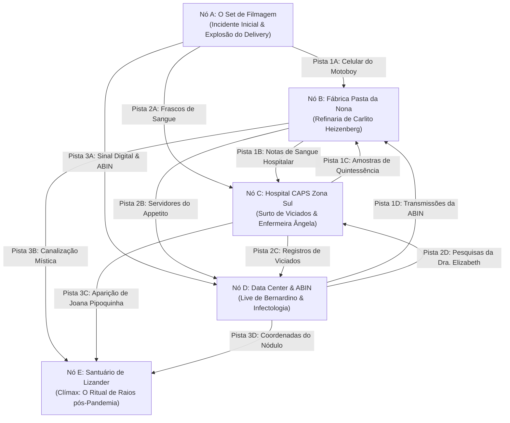

# Arco 01 da Crônica: O Sangue da Metrópole

Este diretório contém a estrutura completa do **Arco 01 da Crônica de Mago: A Ascensão (Presencial)**. O arco utiliza a metodologia **Node-Based Scenario Design** e a **Regra das 3 Pistas (The Three Clue Rule)** de *The Alexandrian*, conectada aos 3 Problemas Motores da campanha e resolvida através do motor **Player-Faced Total (Níveis 1 a 4)**.

---

## 🧭 Grafo de Nós do Arco 01 (The Alexandrian Node Graph)

---

## 📄 Estrutura de Documentos do Arco 01

* 📘 [`00_visao_geral_e_matriz_de_pistas.md`](00_visao_geral_e_matriz_de_pistas.md): A Matriz Alexandrian com a listagem completa das 3 pistas para cada nó e as regras de Pistas Proativas.
* 📍 [`01_no_a_set_de_filmagem.md`](01_no_a_set_de_filmagem.md): **Nó A (Incidente Inicial):** O estouro do gerador no set de filmagem em São Paulo.
* 🏭 [`02_no_b_fabrica_pasta_da_nona.md`](02_no_b_fabrica_pasta_da_nona.md): **Nó B (Logística & Refinaria):** A base do alquimista Carlito Heizenberg e dos Pastafarianos.
* 🏥 [`03_no_c_caps_zona_sul.md`](03_no_c_caps_zona_sul.md): **Nó C (Surto & Revelação Efêmera):** O drama do hospital com Ângela e a manifestação de Joana Pipoquinha.
* 💻 [`04_no_d_data_center_e_abin.md`](04_no_d_data_center_e_abin.md): **Nó D (Infiltração & Guerra de Informação):** Servidores da ABIN, transmissões de Bernardino e vacinas.
* ⚡ [`05_no_e_santuario_de_lizander.md`](05_no_e_santuario_de_lizander.md): **Nó E (O Clímax do Arco 01 - Nível 4):** O grande confronto épico contra Lizander Filho do Raio.
