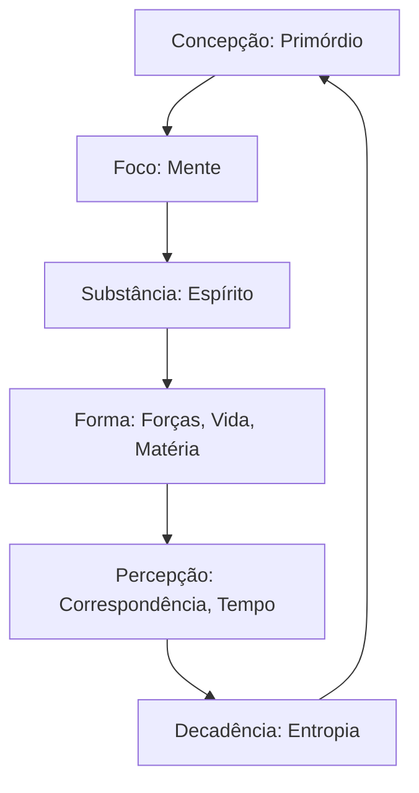

## 3. O Ciclo de Efeito e as Nove Esferas

Toda a realidade é manipulável através de nove princípios universais, divididos no **Ciclo do Efeito**:

```mermaid
graph TD
    A[Concepção: Primórdio] --> B[Foco: Mente]
    B --> C[Substância: Espírito]
    C --> D[Forma: Forças, Vida, Matéria]
    D --> E[Percepção: Correspondência, Tempo]
    E --> F[Decadência: Entropia]
    F --> A
```

