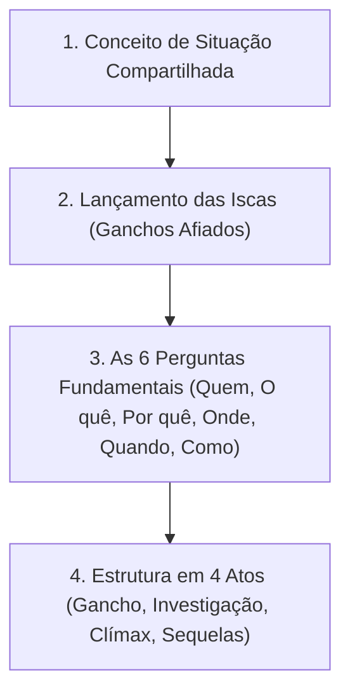

## 🧭 Pilares do Framework Narrativo

```mermaid
graph TD
    A["1. Conceito de Situação Compartilhada"] --> B["2. Lançamento das Iscas (Ganchos Afiados)"]
    B --> C["3. As 6 Perguntas Fundamentais (Quem, O quê, Por quê, Onde, Quando, Como)"]
    C --> D["4. Estrutura em 4 Atos (Gancho, Investigação, Clímax, Sequelas)"]
```

---

