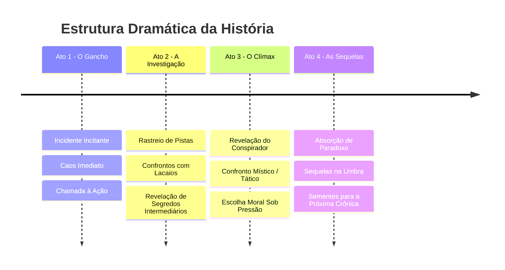

## 4. A Estrutura em 4 Atos da História

```mermaid
timeline
    title Estrutura Dramática da História
    Ato 1 - O Gancho : Incidente Incitante : Caos Imediato : Chamada à Ação
    Ato 2 - A Investigação : Rastreio de Pistas : Confrontos com Lacaios : Revelação de Segredos Intermediários
    Ato 3 - O Clímax : Revelação do Conspirador : Confronto Místico / Tático : Escolha Moral Sob Pressão
    Ato 4 - As Sequelas : Absorção de Paradoxo : Sequelas na Umbra : Sementes para a Próxima Crônica
```

